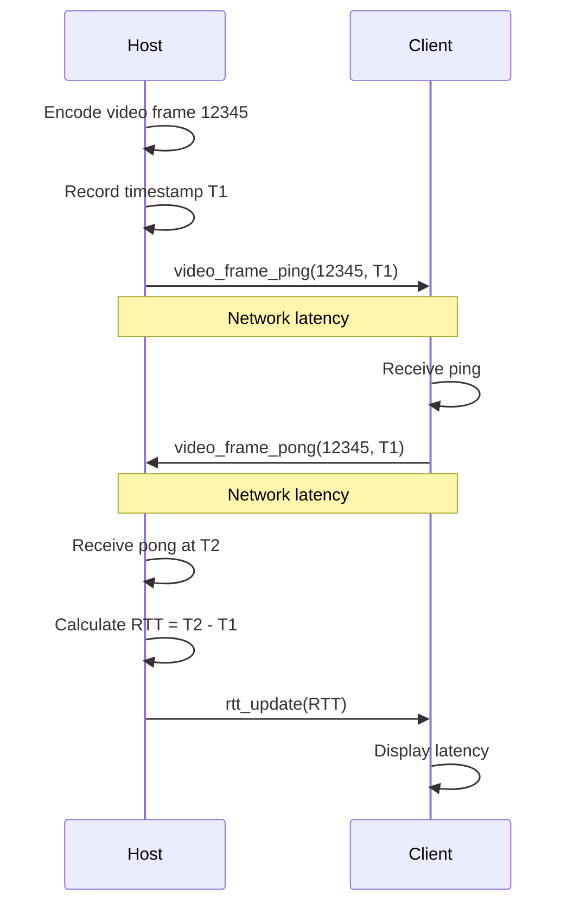

# Feedback Data Channels

CloudGaming uses a dedicated feedback channel for real-time performance monitoring and adaptive quality control. This channel enables round-trip time (RTT) measurement and video frame delivery tracking to optimize streaming quality.

## Channel Configuration

### videoFeedbackChannel

The feedback channel uses **unordered, unreliable** delivery with no retransmissions to minimize measurement overhead.

```javascript
// Client: Create video feedback channel
videoFeedbackChannel = peerConnection.createDataChannel("videoFeedbackChannel", { 
  ordered: false,       // Order not critical for measurements
  maxRetransmits: 0     // Never retransmit to avoid stale data
});
```

**Source:** `Client/html-server/index.html:1409`

**Why unordered and unreliable?**
- Measurements must be instantaneous (old RTT values are useless)
- Lost feedback packets don't affect video delivery
- Retransmission would invalidate latency measurements
- Fresh data is more valuable than complete data

## Message Protocols

### Video Frame Ping/Pong

The host sends ping messages with encoded frames to measure delivery latency. The client immediately responds with pong messages.

#### Ping Message (Host → Client)

```typescript
interface VideoFramePing {
  type: "video_frame_ping";
  frame_id: number;           // Unique frame identifier
  host_send_time: number;     // Host timestamp when frame was sent (ms)
}
```

**Example:**
```json
{
  "type": "video_frame_ping",
  "frame_id": 12345,
  "host_send_time": 1709481234567
}
```

#### Pong Message (Client → Host)

```typescript
interface VideoFramePong {
  type: "video_frame_pong";
  frame_id: number;           // Echo frame ID from ping
  host_send_time: number;     // Echo host timestamp from ping
}
```

**Example:**
```json
{
  "type": "video_frame_pong",
  "frame_id": 12345,
  "host_send_time": 1709481234567
}
```

**Client implementation** (`Client/html-server/index.html:1416-1438`):
```javascript
videoFeedbackChannel.onmessage = (event) => {
  const message = JSON.parse(event.data);

  if (message.type === "video_frame_ping") {
    // Immediately respond with pong
    const pongMessage = {
      type: "video_frame_pong",
      frame_id: message.frame_id,
      host_send_time: message.host_send_time,
    };

    if (videoFeedbackChannel && videoFeedbackChannel.readyState === 'open') {
      videoFeedbackChannel.send(JSON.stringify(pongMessage));
    }
  } else if (message.type === "rtt_update") {
    // Update displayed latency
    latency = message.rtt.toFixed(1);
    updatePerformanceDisplay();
  }
};
```

### RTT Update Message (Host → Client)

The host periodically sends calculated RTT measurements to the client for display.

```typescript
interface RttUpdate {
  type: "rtt_update";
  rtt: number;                // Round-trip time in milliseconds
}
```

**Example:**
```json
{
  "type": "rtt_update",
  "rtt": 12.5
}
```

**Client display update** (`Client/html-server/index.html:1434-1437`):
```javascript
if (message.type === "rtt_update") {
  latency = message.rtt.toFixed(1); // Update global latency variable
  updatePerformanceDisplay(); // Update UI with new latency
}
```

## RTT Measurement

### Calculation Method

Round-trip time is calculated by measuring the time between sending a ping and receiving the corresponding pong:

```
RTT = current_time - host_send_time
```

Where:
- `current_time` = Host timestamp when pong is received
- `host_send_time` = Host timestamp when ping was sent (echoed in pong)

### Measurement Flow



## Adaptive Quality Control

The feedback channel enables the host to dynamically adjust video quality based on network conditions.

### Network Stats Collection

The host monitors multiple metrics beyond RTT (`Host/AdaptiveQualityControl.cpp:17-44`):

```cpp
struct NetworkStats {
    double packetLoss;           // Packet loss percentage (0.0-1.0)
    double rttMs;                // Round-trip time in milliseconds
    double jitterMs;             // Network jitter in milliseconds
    uint32_t nackCount;          // Negative acknowledgment count
    uint32_t pliCount;           // Picture Loss Indication count
    uint32_t twccCount;          // Transport-wide CC feedback count
    uint32_t pacerQueueLength;   // WebRTC pacer queue depth
    uint32_t sendBitrateKbps;    // Current send bitrate
    std::chrono::steady_clock::time_point lastUpdate;
};

void webrtcStatsCallback(double packetLoss, double rtt, double jitter,
                        uint32_t nackCount, uint32_t pliCount, uint32_t twccCount,
                        uint32_t pacerQueueLength, uint32_t sendBitrateKbps) {
    if (globalQualityController.isActive()) {
        NetworkStats stats;
        stats.packetLoss = packetLoss;
        stats.rttMs = rtt;
        stats.jitterMs = jitter * 1000.0;
        stats.nackCount = nackCount;
        stats.pliCount = pliCount;
        stats.twccCount = twccCount;
        stats.pacerQueueLength = pacerQueueLength;
        stats.sendBitrateKbps = sendBitrateKbps;
        stats.lastUpdate = std::chrono::steady_clock::now();
        
        globalQualityController.updateNetworkStats(stats);
    }
}
```

### Network Condition Assessment

The controller categorizes network health into five levels (`Host/AdaptiveQualityControl.cpp:78-118`):

```cpp
enum class NetworkCondition {
    Excellent,  // < 20ms RTT, < 0.1% loss, < 5 queue depth
    Good,       // < 50ms RTT, < 1% loss, < 10 queue depth
    Fair,       // < 100ms RTT, < 3% loss, < 20 queue depth
    Poor,       // < 200ms RTT, < 10% loss, < 50 queue depth
    Critical    // ≥ 200ms RTT, ≥ 10% loss, ≥ 50 queue depth
};

NetworkCondition assessNetworkCondition() const {
    const auto& stats = currentStats;
    
    // Critical: High RTT + High loss + Long queue
    if (stats.rttMs >= config.rttPoorThreshold &&
        stats.packetLoss >= config.lossPoorThreshold &&
        stats.pacerQueueLength >= config.queuePoorThreshold) {
        return NetworkCondition::Critical;
    }
    
    // Poor: High RTT or high loss or long queue
    if (stats.rttMs >= config.rttPoorThreshold ||
        stats.packetLoss >= config.lossPoorThreshold ||
        stats.pacerQueueLength >= config.queuePoorThreshold) {
        return NetworkCondition::Poor;
    }
    
    // Fair: Moderate metrics
    if (stats.rttMs >= config.rttFairThreshold ||
        stats.packetLoss >= config.lossFairThreshold ||
        stats.pacerQueueLength >= config.queueFairThreshold) {
        return NetworkCondition::Fair;
    }
    
    // Good: Low metrics
    if (stats.rttMs <= config.rttGoodThreshold &&
        stats.packetLoss <= config.lossGoodThreshold &&
        stats.pacerQueueLength <= config.queueGoodThreshold) {
        return NetworkCondition::Good;
    }
    
    return NetworkCondition::Excellent;
}
```

### Adaptive Frame Dropping

Based on network conditions, the controller can drop frames to maintain smooth playback (`Host/AdaptiveQualityControl.cpp:120-204`):

```cpp
struct QualityDecision {
    bool shouldDrop;              // Should this frame be dropped?
    NetworkCondition condition;   // Current network state
    double dropRatio;             // Target drop ratio (0.0-1.0)
    uint32_t framesUntilNext;     // Frames until next allowed
    std::string reason;           // Human-readable explanation
};

QualityDecision shouldDropFrame() {
    if (!isEnabled.load(std::memory_order_relaxed)) {
        return {false, NetworkCondition::Excellent, 0.0, 0, "Disabled"};
    }
    
    // Fast path: skip mutex when no dropping needed (localhost)
    if (!g_dropMayBeNeeded.load(std::memory_order_relaxed)) {
        return {false, NetworkCondition::Excellent, 0.0, 0, "Fast path"};
    }
    
    std::lock_guard<std::mutex> lock(droppingState.mutex);
    
    // Check minimum frame interval
    auto now = std::chrono::steady_clock::now();
    auto timeSinceLastFrame = std::chrono::duration_cast<std::chrono::milliseconds>(
        now - droppingState.lastFrameTime).count();
    
    if (timeSinceLastFrame < config.minFrameIntervalMs) {
        return {true, NetworkCondition::Excellent, 0.0, 1,
                "Frame rate too high, enforcing interval"};
    }
    
    // Assess network and determine drop ratio
    NetworkCondition condition = assessNetworkCondition();
    double dropRatio = 0.0;
    
    switch (condition) {
        case NetworkCondition::Excellent:
            dropRatio = 0.0;    // No dropping
            break;
        case NetworkCondition::Good:
            dropRatio = 0.0;    // No dropping
            break;
        case NetworkCondition::Fair:
            dropRatio = 0.1;    // Drop 10% of frames
            break;
        case NetworkCondition::Poor:
            dropRatio = 0.25;   // Drop 25% of frames
            break;
        case NetworkCondition::Critical:
            dropRatio = 0.5;    // Drop 50% of frames
            break;
    }
    
    // Counter-based dropping for even distribution
    bool shouldDrop = false;
    if (dropRatio > 0.0) {
        uint32_t dropInterval = static_cast<uint32_t>(1.0 / dropRatio);
        shouldDrop = (droppingState.frameCounter % dropInterval) != 0;
    }
    
    droppingState.frameCounter++;
    
    if (shouldDrop) {
        droppingState.framesDropped++;
        return {true, condition, dropRatio, 0,
                "Network degraded: RTT=" + std::to_string(currentStats.rttMs) + "ms"};
    } else {
        droppingState.framesSent++;
        return {false, condition, dropRatio, 0, "Frame accepted"};
    }
}
```

### Quality Thresholds

Default configuration values for network assessment:

```cpp
struct DroppingConfig {
    // RTT thresholds (milliseconds)
    double rttExcellentThreshold = 20.0;
    double rttGoodThreshold = 50.0;
    double rttFairThreshold = 100.0;
    double rttPoorThreshold = 200.0;
    
    // Packet loss thresholds (0.0-1.0)
    double lossExcellentThreshold = 0.001;  // 0.1%
    double lossGoodThreshold = 0.01;        // 1%
    double lossFairThreshold = 0.03;        // 3%
    double lossPoorThreshold = 0.1;         // 10%
    
    // Pacer queue thresholds (packet count)
    uint32_t queueExcellentThreshold = 5;
    uint32_t queueGoodThreshold = 10;
    uint32_t queueFairThreshold = 20;
    uint32_t queuePoorThreshold = 50;
    
    // Frame dropping ratios
    double excellentDropRatio = 0.0;   // No dropping
    double goodDropRatio = 0.0;        // No dropping
    double fairDropRatio = 0.1;        // Drop 10%
    double poorDropRatio = 0.25;       // Drop 25%
    double criticalDropRatio = 0.5;    // Drop 50%
    
    // Frame rate control
    uint32_t minFrameIntervalMs = 0;   // Minimum ms between frames
    bool enableAdaptiveDropping = true;
};
```

## Client-Side Performance Display

The client displays real-time performance metrics based on feedback data (`Client/html-server/index.html:910-920`):

```javascript
function updatePerformanceDisplay() {
  document.getElementById('fpsValue').textContent = `${fps} fps`;
  document.getElementById('latencyValue').textContent = `${latency} ms`;
  document.getElementById('bitrateValue').textContent = `${bitrateKbps} kbps`;
  
  // Quality based on decoded fps from network
  const q = netFps > 50 ? 'Excellent' : netFps > 30 ? 'Good' : 'Poor';
  document.getElementById('qualityValue').textContent = q;
  
  const qualityLevel = netFps > 50 ? 4 : netFps > 30 ? 3 : netFps > 15 ? 2 : 1;
  updateQualityIndicator(qualityLevel);
}
```

### Visual Quality Indicator

The client shows connection quality with colored bars (`Client/html-server/index.html:898-909`):

```javascript
function updateQualityIndicator(quality) {
  const bars = ['q1', 'q2', 'q3', 'q4'];
  bars.forEach((id, index) => {
    const bar = document.getElementById(id);
    bar.className = 'quality-bar';
    if (index < quality) {
      if (quality >= 3) bar.classList.add('active');      // Green
      else if (quality >= 2) bar.classList.add('medium'); // Orange
      else bar.classList.add('poor');                     // Red
    }
  });
}
```

## WebRTC Stats Integration

The client monitors WebRTC stats to measure actual network performance (`Client/html-server/index.html:1238-1260`):

```javascript
// Poll WebRTC stats every second
let lastFramesDecoded = 0;
let lastBytes = 0;
let lastStatsTime = performance.now();

activeStatsTimer = setInterval(async () => {
  if (!peerConnection) return;
  
  try {
    const stats = await peerConnection.getStats();
    let inbound = null;
    
    // Find inbound video stats
    stats.forEach(report => {
      if (report.type === 'inbound-rtp' && report.kind === 'video') {
        inbound = report;
      }
    });
    
    if (!inbound) return;
    
    const now = performance.now();
    const dt = Math.max(1, now - lastStatsTime);
    
    // Calculate decoded FPS
    const frames = inbound.framesDecoded || 0;
    netFps = Math.round(((frames - lastFramesDecoded) * 1000) / dt);
    
    // Calculate bitrate
    const bytes = inbound.bytesReceived || 0;
    bitrateKbps = Math.round(((bytes - lastBytes) * 8) / dt);
    
    lastFramesDecoded = frames;
    lastBytes = bytes;
    lastStatsTime = now;
    
    updatePerformanceDisplay();
  } catch (e) {}
}, 1000);
```

## Congestion Detection

The system detects network congestion through multiple signals (`Host/AdaptiveQualityControl.cpp:240-244`):

```cpp
// Log congestion signals
if (stats.pliCount > 0 || stats.nackCount > 0) {
    LOG_WARN("Network congestion detected - PLI: " + std::to_string(stats.pliCount) +
            ", NACK: " + std::to_string(stats.nackCount));
}
```

**Congestion Indicators:**

- **NACK (Negative Acknowledgment):** Packet loss requiring retransmission
- **PLI (Picture Loss Indication):** Decoder requests keyframe due to corruption
- **High pacer queue:** Encoder producing faster than network can send
- **Increasing RTT:** Network buffers filling up
- **Packet loss:** Unreliable network path

## Best Practices

### For Implementers

1. **Keep feedback lightweight:** Use minimal JSON to reduce overhead
2. **Never block on feedback:** Use unreliable channel to avoid stalls
3. **Validate timestamps:** Ensure monotonic time for accurate RTT
4. **Smooth measurements:** Use moving average to filter noise
5. **React gradually:** Don't make drastic quality changes on single spikes

### For Performance

1. **Minimize ping frequency:** Only ping when quality decision needed
2. **Fast-path optimization:** Skip mutex when network is excellent
3. **Batch updates:** Send rtt_update only when value changes significantly
4. **Disable when not needed:** Turn off adaptive quality on LAN

### For Monitoring

```javascript
// Example: Track feedback channel health
videoFeedbackChannel.onopen = () => {
  console.log('Feedback channel open');
  startPingPongMonitoring();
};

videoFeedbackChannel.onclose = () => {
  console.log('Feedback channel closed');
  stopPingPongMonitoring();
};

videoFeedbackChannel.onerror = (error) => {
  console.error('Feedback channel error:', error);
  // Fallback: Use WebRTC stats only
};
```

## Troubleshooting

### High RTT Values

- Check network path (local vs internet)
- Verify no unnecessary proxies/VPNs
- Test with ping to rule out host issues
- Monitor CPU usage (processing delays)

### Feedback Channel Not Opening

- Verify WebRTC connection established first
- Check data channel support in browser
- Inspect signaling for channel negotiation
- Try ordered:true if failing to open

### Inaccurate Latency Display

- Ensure client/host time sync (use relative deltas)
- Check for clock drift on long sessions
- Filter outliers (network hiccups)
- Compare with WebRTC native RTT

## Related Documentation

- [Input Channels](/api/data-channels/input) - Keyboard and mouse input
- [Video Configuration](/configuration/video) - Video encoding settings
- [Monitoring](/operations/monitoring) - Performance monitoring and metrics
- [Performance Tuning](/operations/performance-tuning) - Optimize video and network performance
