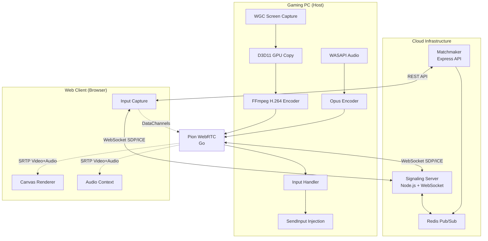
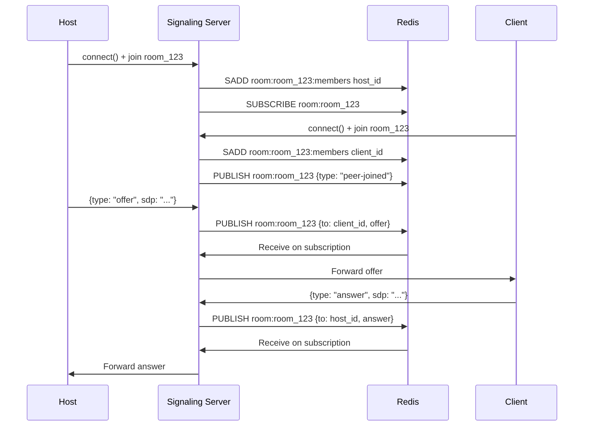

# System Architecture

CloudGaming uses a hybrid architecture: centralized signaling with decentralized peer-to-peer streaming. This design minimizes server costs while maintaining ultra-low latency.

## Architecture Overview



## Core Components

### Host Runtime

The host is a hybrid C++/Go application running on Windows that captures, encodes, and streams the desktop.

<AccordionGroup>
  <Accordion title="C++ Layer (Host/)">
    **Responsibilities:**
    - Windows Graphics Capture (WGC) for screen capture
    - D3D11 texture management and GPU memory copy
    - FFmpeg integration for H.264 encoding (NVENC/QSV/AMF)
    - WASAPI audio capture with Opus encoding
    - Input injection via SendInput API
    - Configuration management and matchmaker client
    
    **Key Files:**
    - `Host/main.cpp` - Application entry point
    - `Host/GraphicsAndCapture.cpp` - WGC capture setup
    - `Host/Encoder.cpp` - FFmpeg encoding pipeline
    - `Host/AudioCapturer.cpp` - WASAPI + Opus audio
    - `Host/KeyInputHandler.cpp` - Keyboard input injection
    - `Host/MouseInputHandler.cpp` - Mouse input injection
  </Accordion>
  
  <Accordion title="Go Layer (gortc_main/main.go)">
    **Responsibilities:**
    - WebRTC peer connection via Pion library
    - RTP packet handling and SRTP encryption
    - DataChannel management for input
    - RTCP feedback (TWCC, PLI, NACK)
    - Network quality monitoring
    
    **Exposed C API:**
    ```go
    //export InitWebRTC
    func InitWebRTC(roomId *C.char, signalingUrl *C.char)
    
    //export SendVideoFrame
    func SendVideoFrame(data unsafe.Pointer, size C.int, timestampUs C.int64)
    
    //export SendAudioFrame  
    func SendAudioFrame(data unsafe.Pointer, size C.int, timestampUs C.int64)
    ```
  </Accordion>
  
  <Accordion title="Capture Pipeline">
    1. **WGC Capture** (`Windows.Graphics.Capture` API)
       - Captures target window/process at configured FPS
       - Outputs D3D11 textures in GPU memory
    
    2. **D3D11 Copy Pool** (8 textures)
       - Asynchronous GPU-to-GPU copy to avoid stalls
       - Ring buffer prevents encoder blocking capture
    
    3. **FFmpeg Encoding**
       - Hardware-accelerated H.264 (NVENC preferred)
       - CBR rate control for consistent bitrate
       - B-frames disabled (bf=0) for minimum latency
    
    4. **Frame Pacing**
       - `MinUpdateInterval` enforces frame timing
       - Adaptive backoff when encoder saturated
  </Accordion>
  
  <Accordion title="Audio Pipeline">
    1. **WASAPI Loopback Capture**
       - Process-specific audio (Windows 11)
       - 48kHz stereo, 10ms frames
    
    2. **Opus Encoding**
       - 80kbps bitrate, complexity 6
       - Forward Error Correction (FEC) enabled
       - 10ms frame size for low latency
    
    3. **RTP Transmission**
       - Sent via WebRTC audio track
       - Synchronized with video via NTP timestamps
  </Accordion>
</AccordionGroup>

### Signaling Server

Node.js WebSocket server that coordinates WebRTC connection setup.

**File:** `Server/ScalableSignalingServer.js`

```javascript
// Core functionality
const WebSocket = require('ws');
const { createClient } = require('redis');

// Redis pub/sub for multi-instance signaling
const redisClient = createClient({ url: config.redisUrl });
const subscriber = redisClient.duplicate();

// Room-based message routing
subscriber.subscribe(`room:*`, (message, channel) => {
  const roomId = channel.split(':')[1];
  broadcastToRoom(roomId, JSON.parse(message));
});
```

<Note>
  The signaling server uses **Redis pub/sub** to enable horizontal scaling. Multiple signaling instances can run simultaneously, with messages routed via Redis channels.
</Note>

**Key Features:**
- WebSocket server on port 3002
- Room-based peer routing
- Rate limiting (100 msg/min per connection)
- Schema validation with circuit breaker
- Health checks and Prometheus metrics
- Atomic join/leave operations via Lua scripts

**Message Flow:**


### Matchmaker

Express.js API that tracks host availability and assigns clients.

**File:** `Server/mm_server/Matchmaker.js`

```javascript
// Host registration with TTL
app.post('/api/host/heartbeat', async (req, res) => {
  const { hostId, roomId, region, status } = req.body;
  
  await redis.set(`host:${hostId}`, JSON.stringify({
    hostId, roomId, status: status || 'idle',
    region, lastHeartbeat: Date.now()
  }), 'EX', 30);  // 30-second TTL
  
  res.json({ success: true, ttl: 30 });
});

// Client matchmaking
app.post('/api/match/find', async (req, res) => {
  const { region } = req.body;
  
  const keys = await redis.keys('host:*');
  for (const key of keys) {
    const host = JSON.parse(await redis.get(key));
    if (host.status === 'idle' && (!region || host.region === region)) {
      const iceServers = await getIceServers();  // Metered TURN
      return res.json({
        found: true,
        roomId: host.roomId,
        signalingUrl: config.signalingUrl,
        iceServers
      });
    }
  }
  
  res.status(404).json({ found: false });
});
```

**API Endpoints:**

| Endpoint | Method | Description |
|----------|--------|-------------|
| `/api/host/heartbeat` | POST | Host registration/keepalive (20s interval) |
| `/api/host/status` | POST | Update host status (idle/busy) |
| `/api/match/find` | POST | Find available host for client |

<Info>
  Hosts send heartbeats every 20 seconds. If a host crashes, the Redis key expires after 30 seconds and it's automatically removed from the pool.
</Info>

### Web Client

Pure HTML/JavaScript client using native WebRTC APIs.

**File:** `Client/html-server/index.html`

```javascript
// Matchmaking request
const matchResponse = await fetch(`${matchmakerUrl}/api/match/find`, {
  method: 'POST',
  headers: { 'Content-Type': 'application/json' },
  body: JSON.stringify({ region: 'us-east-1' })
});
const { roomId, signalingUrl, iceServers } = await matchResponse.json();

// WebRTC peer connection
const pc = new RTCPeerConnection({ iceServers });

pc.ontrack = (event) => {
  const video = document.getElementById('gameCanvas');
  video.srcObject = event.streams[0];
};

// Input capture and DataChannel send
document.addEventListener('keydown', (e) => {
  inputChannel.send(JSON.stringify({
    type: 'keydown',
    key: e.key,
    code: e.code
  }));
});
```

**Key Features:**
- Canvas-based video rendering
- Web Audio API for low-latency playback
- Keyboard/mouse event capture
- Pointer lock for FPS games
- Immersive fullscreen mode (F11)

## WebRTC P2P Connection

### Connection Establishment

<Steps>
  <Step title="ICE Candidate Exchange">
    Both peers discover their network addresses (local, STUN reflexive, TURN relay) and exchange them via the signaling server.
  </Step>
  
  <Step title="DTLS Handshake">
    Encrypted media transport is established using DTLS-SRTP.
  </Step>
  
  <Step title="DataChannels">
    Reliable ordered DataChannels are created for input events and ping/pong.
  </Step>
  
  <Step title="Media Tracks">
    Video and audio RTP streams begin flowing once ICE completes.
  </Step>
</Steps>

### Network Quality Monitoring

The Go layer monitors WebRTC statistics and reports to C++:

```go
// RTCP feedback processing
func processRTCPPackets(packets []rtcp.Packet) {
    for _, pkt := range packets {
        switch p := pkt.(type) {
        case *rtcp.ReceiverReport:
            packetLoss := calculateLoss(p)
            rtt := calculateRTT(p)
            // Update encoder bitrate based on loss/rtt
            notifyQualityChange(packetLoss, rtt)
        
        case *rtcp.PictureLossIndication:
            // Request keyframe from encoder
            requestKeyframe()
        }
    }
}
```

<Tip>
  The platform uses **TWCC (Transport-Wide Congestion Control)** for real-time bandwidth estimation and adaptive bitrate control.
</Tip>

## Data Flow Summary

### Downstream (Host → Client)

```
Game Window
  ↓
WGC Capture (60 FPS)
  ↓
D3D11 Texture (GPU memory)
  ↓  
FFmpeg NVENC (H.264, 8 Mbps CBR)
  ↓
Pion WebRTC (RTP packetization)
  ↓
DTLS-SRTP encryption
  ↓
UDP packets (P2P)
  ↓
Browser WebRTC stack
  ↓
Canvas rendering (60 FPS)
```

### Upstream (Client → Host)

```
Keyboard/Mouse event
  ↓
JavaScript event handler
  ↓
WebRTC DataChannel (JSON)
  ↓
SCTP over DTLS
  ↓
UDP packets (P2P)
  ↓
Pion DataChannel receive
  ↓
C++ input queue
  ↓
Windows SendInput API
  ↓
Game receives input
```

## Scaling Considerations

<CardGroup cols={2}>
  <Card title="Horizontal Scaling" icon="layer-group">
    Multiple signaling server instances share load via Redis pub/sub. Add more instances behind a load balancer.
  </Card>
  
  <Card title="Geographic Distribution" icon="earth-americas">
    Deploy signaling servers and matchmakers in multiple regions. Route clients to nearest region.
  </Card>
  
  <Card title="Host Pooling" icon="server">
    Matchmaker tracks hosts across regions. Scale by adding more gaming PCs to the pool.
  </Card>
  
  <Card title="TURN Fallback" icon="shield">
    Use Metered.ca or Coturn for TURN relay when P2P fails. Costs scale with relayed bandwidth.
  </Card>
</CardGroup>

<Warning>
  **P2P Limitation**: Each host can only stream to one client at a time. For 1:N streaming, use SFU (Selective Forwarding Unit) architecture instead.
</Warning>

## Performance Characteristics

| Metric | Value | Notes |
|--------|-------|-------|
| Glass-to-glass latency | 30-50ms | P2P on LAN/good internet |
| Encoding latency | 8-15ms | With NVENC p2 preset |
| Network latency | 10-30ms | Depends on peer distance |
| Video bitrate | 8-80 Mbps | Adaptive based on network |
| Audio bitrate | 80 kbps | Opus with FEC |
| CPU usage (host) | 5-15% | With GPU encoding |
| GPU usage (host) | 15-30% | Includes game rendering |

## Next Steps

<CardGroup cols={2}>
  <Card title="Configuration Reference" icon="book" href="/configuration">
    Detailed config.json documentation
  </Card>
  
  <Card title="API Reference" icon="code" href="/api-reference">
    Matchmaker and signaling API specs
  </Card>
</CardGroup>
