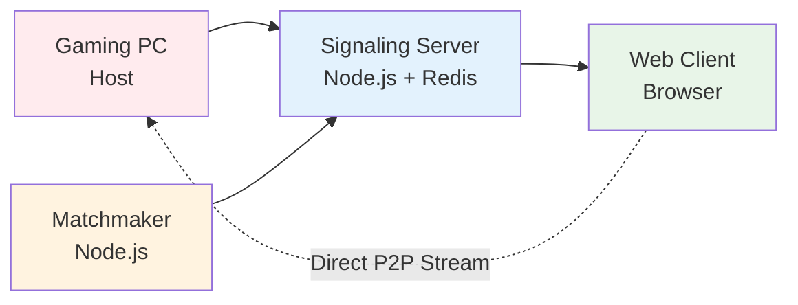

# Welcome to CloudGaming

A high-performance, peer-to-peer cloud gaming and remote desktop platform that streams directly from your Windows PC to any browser with ultra-low latency.

## What is CloudGaming?

CloudGaming is a WebRTC-based streaming platform that captures your screen and audio on a Windows host, encodes it using hardware-accelerated H.264 (NVENC/QSV/AMF), and streams it peer-to-peer to web clients. Input (keyboard and mouse) flows back over WebRTC DataChannels, enabling true real-time remote gaming and desktop access.

<Info>
  **Perfect for**: Game streaming, remote desktop access, cloud gaming services, and low-latency screen sharing applications
</Info>

## Key Features

<CardGroup cols={2}>
  <Card title="Ultra-Low Latency" icon="gauge-high">
    Sub-40ms glass-to-glass latency with direct P2P streaming, no relay servers required
  </Card>
  
  <Card title="Hardware Acceleration" icon="microchip">
    FFmpeg-powered encoding with NVENC, Intel QSV, and AMD AMF support for high FPS at low CPU usage
  </Card>
  
  <Card title="Adaptive Quality" icon="sliders">
    Dynamic bitrate control (8-80 Mbps) based on network conditions with WebRTC TWCC feedback
  </Card>
  
  <Card title="High Frame Rate" icon="film">
    Support for 60-144 FPS capture and streaming for smooth gaming experiences
  </Card>
  
  <Card title="P2P Architecture" icon="network-wired">
    Direct peer-to-peer connections via WebRTC with Redis-based signaling for scalability
  </Card>
  
  <Card title="Real-Time Input" icon="keyboard">
    Bi-directional input injection with DPI-aware mouse handling and configurable policies
  </Card>
  
  <Card title="Process Audio Capture" icon="volume-high">
    Windows 11 process-specific audio loopback with Opus encoding (80kbps, 10ms frames)
  </Card>
  
  <Card title="Browser-Based Client" icon="globe">
    No installation required - clients connect via any modern web browser
  </Card>
</CardGroup>

## Architecture Overview

The platform consists of four main components:

<CardGroup cols={2}>
  <Card title="Host Runtime" icon="desktop" href="/architecture#host-runtime">
    C++ application with Go WebRTC bindings for capture, encoding, and streaming
  </Card>
  
  <Card title="Signaling Server" icon="tower-broadcast" href="/architecture#signaling-server">
    Node.js WebSocket server with Redis pub/sub for multi-instance scaling
  </Card>
  
  <Card title="Matchmaker" icon="users" href="/architecture#matchmaker">
    Automatic host discovery and session assignment with heartbeat monitoring
  </Card>
  
  <Card title="Web Client" icon="browser" href="/architecture#web-client">
    Pure HTML/JavaScript WebRTC client with canvas rendering and input capture
  </Card>
</CardGroup>

## Technology Stack

<Note>
  **Host**: C++ (WGC capture, FFmpeg encoding) + Go (Pion WebRTC)  
  **Server**: Node.js, ws, Redis, Express  
  **Client**: HTML5, WebRTC API, Canvas  
  **Encoding**: H.264 (NVENC/QSV/AMF), Opus audio  
  **Networking**: WebRTC (SRTP video/audio, DataChannels for input)
</Note>

## Quick Links

<CardGroup cols={3}>
  <Card title="Quick Start" icon="rocket" href="/quickstart">
    Get up and running in minutes
  </Card>
  
  <Card title="Architecture" icon="diagram-project" href="/architecture">
    Deep dive into system design
  </Card>
  
  <Card title="Configuration" icon="gear" href="/configuration">
    Configure video, audio, and input settings
  </Card>
</CardGroup>

## Use Cases

- **Cloud Gaming**: Stream games from your powerful PC to any device
- **Remote Desktop**: Access your work computer from anywhere
- **Game Development**: Test games remotely during development
- **LAN Parties**: Host gaming sessions without physical hardware
- **Content Creation**: Stream high-quality gameplay for recording

<Tip>
  Ready to get started? Head over to the [Quick Start Guide](/quickstart) to set up your first streaming session.
</Tip>
